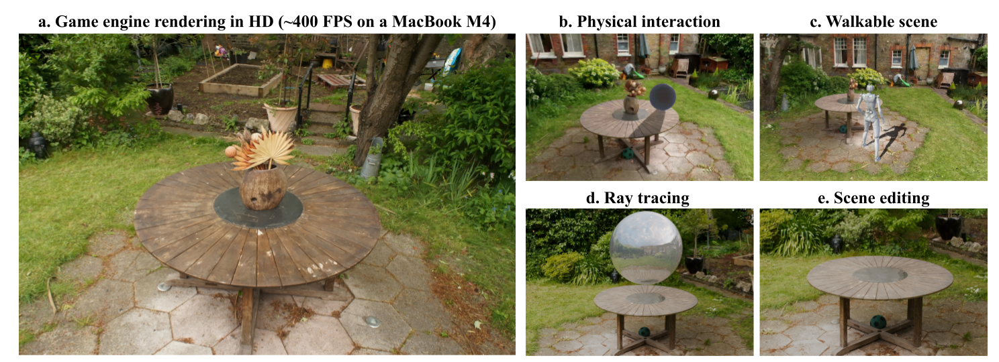

<h1 align="center">Triangle Splatting+: Differentiable Rendering with Opaque Triangles</h1>

<div align="center">
  <a href="https://trianglesplatting2.github.io/trianglesplatting2/">Project page</a> &nbsp;|&nbsp;
  <a href="https://arxiv.org/abs/2509.25122">Arxiv</a> &nbsp;|&nbsp; 
</div>
<br>

<p align="center">
  Jan Held, Renaud Vandeghen, Sanghyun Son, Daniel Rebain, Matheus Gadelha, Yi Zhou, Ming C. Lin, Marc Van Droogenbroeck, Andrea Tagliasacchi
</p>

<br>

<div align="center">
  
</div>

This repo contains the official implementation for the paper "Triangle Splatting+: Differentiable Rendering with Opaque Triangles". 

We introduce **Triangle Splatting+**, which directly optimizes triangles, the fundamental primitive of computer graphics, within a differentiable splatting framework. We formulate triangle parametrization to enable connectivity through shared vertices, and we design a training strategy that enforces opaque triangles. The final output is immediately usable in standard graphics engines without post-processing.  
Our method surpasses prior splatting approaches in visual fidelity while remaining efficient and fast to train. Moreover, the resulting meshes support downstream applications such as physics-based simulation or interactive walkthroughs. 

🔔The code will be released the 8th of October.🔔

## Download optimized ply files (+-50MB)

If you want to run some scene on a game engine for yourself, you can download the Garden, Bicycle or Truck scenes from the following <a href="https://drive.google.com/drive/folders/1HMddW9_OMG2UCBWoJmspkoXBplf2PH5x">link</a>. To achieve the highest visual quality, you should use 4× supersampling.


## Download the Unity project to explore physics-based interactions and walkable scenes

If you want to try out physics interactions or explore the environment with a character, you can download the Unity project from the link below: <a href="https://drive.google.com/drive/folders/1XzCqfYbsB7Ff9HI6B90AtWM-9VKTsLel">link</a>. To achieve the highest visual quality, you should use 4× supersampling.

## BibTeX
If you find our work interesting or use any part of it, please cite our paper:
```bibtex
@article{Held2025Triangle,
title = {Triangle Splatting+: Differentiable Rendering with Opaque Triangles},
author = {Held, Jan and Vandeghen, Renaud and Son, Sanghyun and Rebain, Daniel and Gadelha, Matheus and Zhou, Yi and Lin, Ming C. and Van Droogenbroeck, Marc and Tagliasacchi, Andrea},
journal = {arXiv},
year = {2025}
}
```

## Acknowledgements
J. Held is funded by the F.R.S.-FNRS. The present research benefited from computational resources made available on Lucia, the Tier-1 supercomputer of the Walloon Region, infrastructure funded by the Walloon Region under the grant agreement n°1910247.

